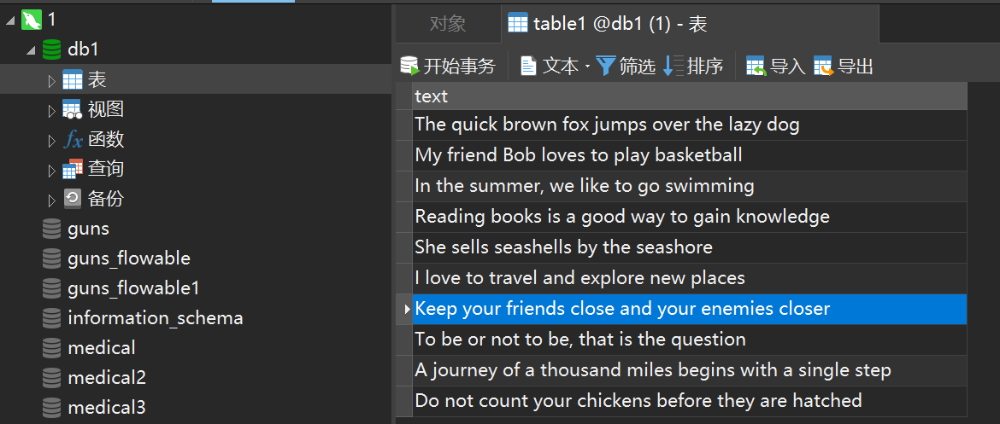

# 概要设计

1. 输入类Input：使用已有库，解析命令行参数，根据参数获取程序输入，并提供接口供外部调用以获取结构化输入。
	1. 参考的命令行参数如下（**参数应该保证一次选择一种**，否则应当**报错**，缺失或非法参数也应当**报错**，无法解析的参数也应当**报错**）：
		1. `-f(--file) 输入文件名`，从文件读取输入，例如：`java app -f a.txt`；
		2. `-s(--socket)`，作为网络接收端读取输入，例如：`java app -s`；
		3. `-p(--pipe)`，接收管道输入，例如：`echo "Test" | java app -p`；
		4. `-i(--interact)`，从用户交互读取输入，例如：`java app -i`；
		5. `-m(--message)`，从中间件读取输入。用例缺失，不了解中间件。
		6. `[-o(--outfile) 输出文件名]`，可选输入，用于规定输出文件的位置，默认设置为执行文件所在位置。例如：`java app -o output.txt`
	2. **对外提供接口**
		1. `void parseInput()`，无参数，解析命令行参数后获取程序输入。
		2. `ArrayList<String> getInputLines()`，无参数，返回值`ArrayList<String>`，每一个String代表输入文本的一行。
		3. `String getSaveLocation()`，无参数，返回值`String`，代表输出文件的存储位置。
	3. 测试接口
		1. 自己写一个测试函数，证明模块的有效性。（测试用例自拟）
2. 循环移位类Shifter：将输入的每一行按字（单词）拆分后，对每一行以字为单位进行循环移位，生成这一行的循环移位后的所有字符串集，对每一行重复上述操作后生成整个文档的所有行、经过所有循环移位后的列表，并提供接口供外部调用以获取结构化输入。
	1. **对外提供接口**
		1. `ArrayList<String> getShiftedLines(ArrayList<String> inputLines)`，完成对参数`inputLines`的每一行`line`的循环移位，返回处理好后的结果。注意错误处理：包括不限于空行。
		2. `ArrayList<String> getShiftedLine(String line)`，由`getShiftedLines()`调用，完成对参数`line`的循环移位，返回处理好后的结果。注意错误处理：包括不限于空行。
	2. 测试接口
		1. 自己写一个测试函数，证明模块的有效性。（测试用例自拟）
3. 排序类Sort：对读取的字符串数组排序，返回排序后的结果。
	1. **对外提供接口**
		1. `ArrayList<String> getSortedLines(ArrayList<String> lines)`，完成对参数`lines`的按字母升序排序，返回排序好的结果。注意错误处理：包括不限于空行。
	2. 测试接口
		1. 自己写一个测试函数，证明模块的有效性。（测试用例自拟）
4. 输出类Output：
	1. **对外提供接口**
		1. `save(ArrayList<String> content, String saveLoc)`，将`content`存储到`saveLoc`文件指定的地址。注意错误处理：包括不限于位置不存在、文件已存在。
	2. 测试接口
		1. 自己写一个测试函数，证明模块的有效性。（测试用例自拟）
5. Main：统筹调度各个类的实例化，完成整体程序的运行。
	1. 伪代码示例见下文。

```Java
public static void main(String[] args) {
	Input input = new Input();
	input.parseInput();
	Shifter shifter = new Shifter();
	Sort sort = new Sort();
	Output output = new Output();
	ArrayList<String> outputLines= sort.getSortedLines(shifter.getShiftedLines(input.getInputLines()));
	output.save(outputLines, input.getSaveLocation());
}
```


# 代码注意事项

1. **异常处理**
	1. 不要简单地使用`try catch`就完事了，尽可能细分为不同的具体的错误，例如：`try {} catch IOException as e {} catch FileException as e {}`。
	2. 根据具体的业务说明错误的具体问题，不要单纯打印错误名，例如：不要只打印`IOException`，而是类似于`发现IO错误，无法找到对应的文件信息`。
2. **代码风格要求**
	1. 重点是命名，以及模块注释。参考链接见：[# Java开发都需要参考的一份命名规范](https://zhuanlan.zhihu.com/p/97939831)

# 测试

1. 使用`Shell`或`Python`完成多组自动化测试代码的撰写。自拟测试用例。

# 运行环境与运行注意事项
1. **JDK版本8**
2. **直接文件模式**  
   默认输出出文件名为out.txt，如果已经存在则不会覆盖，会报错并结束
3. **数据库输入模式**  
   需要在localhost:3306运行着MySQL服务，有一个名为db1的数据库，用户名密码写死在代码里了，请务必确认并改成自己的改成自己的，并按照给出的init.sql建表。  
   > 对于原始数据，我们并没有提供一个模拟的向数据库中输入的程序。我们只在init.sql中简单插入一些数据，这也就意味着数据不会很多。  
   >
   > 与数据库方式类似，其他非直接文件方式都有类似的性质。有一点需要注意。虽然代码中是一次性全读进来，但是仍然是逐行的方式，这就意味着数据源提供的数据也应当是逐行的，详细请看Input的实现方式。

      你准备好的数据库环境应该如图
4. **Socket输入模式**  
   先运行SocketSender，再运行App。SocketSender发送的数据写死在了代码里，请查看。
5. **消息中间件模式**  
   需要在localhost:5672运行着RabbitMQ服务，并且最好不存在名为"text"的队列。先运行RabbitMQSender并**等待运行结束**后再运行App
6. **用户输入模式**  
   用户输入的一行对应KWIC输入的一行。最终以EOF结束（很有可能是`Ctrl+D`）
7. **管道输入模式**  
   No Comment